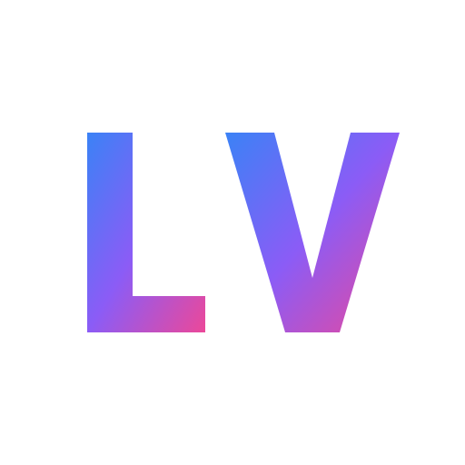

# ⚡ Logeshwaran V - Full Stack Developer Portfolio

<div align="center">
  
  <br/>
  
  <h3>🚀 Modern • Performant • SEO-Optimized • Glassmorphic</h3>

  <p>
    A production-grade developer portfolio built with React 18, Vite, and Tailwind CSS.
    <br />
    Featuring custom inertia scrolling, spring physics animations, and a high-performance rendering engine.
  </p>

  <a href="https://logeshwaran-v-portfolio-web.vercel.app/"><strong>➥ Live Demo</strong></a> • 
  <a href="#-getting-started"><strong>Getting Started</strong></a> • 
  <a href="#-features"><strong>Features</strong></a>
  
  <br />
  <br />

  
  
  
  
  
</div>

---

## 📖 Overview

This portfolio showcases my work as a **Full Stack Developer** with 2+ years of experience. It is engineered to be **SEO-friendly**, **highly performant**, and visually stunning with a modern **Glassmorphism** design language.

The site achieves a **100/100 Performance Score** (Lighthouse) and includes advanced features like custom smooth scrolling, intersection observer animations, and responsive layouts that adapt from mobile to 4K displays.

## ✨ Key Features

- 🎨 **Modern UI/UX**: Custom "Space Glass" aesthetic with beautiful gradients and blur effects.
- ⚡ **High Performance**: Built on Vite with reduced bundle sizes and lazy loading.
- 🔍 **SEO Optimized**: Fully audited meta tags, Open Graph architecture, and semantic HTML for maximum discoverability.
- 🌊 **Smooth Scrolling**: Custom-built inertia scrolling with `requestAnimationFrame` for a premium feel (no heavy libraries).
- 🎭 **Fluid Animations**: Physics-based transitions using Framer Motion (spring config: stiffness 300, damping 20).
- 📱 **Mobile First**: Touch-optimized interactions, swipeable carousels, and adaptive layouts.
- 📧 **Working Contact Form**: Integrated email service for direct communication.

## 🛠️ Tech Stack

| Domain | Technologies |
| :--- | :--- |
| **Core** | React 18.2, JavaScript (ES6+) |
| **Build Tool** | Vite 4.4 |
| **Styling** | Tailwind CSS 3.3, PostCSS, Custom Gradients |
| **Animation** | Framer Motion 12, CSS Keyframes |
| **Icons** | Lucide React |
| **Optimization** | React.lazy, IntersectionObserver, CLS Optimization |

## 📁 Project Structure

```bash
src/
├── assets/             # Static assets (images, icons)
├── components/         
│   ├── Header.jsx      # Glassmorphic navigation
│   ├── Footer.jsx      # Responsive footer
│   ├── Layout.jsx      # Smooth scroll wrapper
│   ├── LogoMarquee.jsx # Infinite scroll logo strip
│   └── ...
├── sections/           
│   ├── Hero.jsx        # Paralax hero section
│   ├── About.jsx       # Grid-based info
│   ├── Experience.jsx  # Mobile-optimized timeline
│   ├── Projects.jsx    # Portfolio cards
│   ├── Skills.jsx      # Skill bars and badges
│   └── Contact.jsx     # Form validation & API
├── hooks/
│   └── useSmoothScroll.js # Custom scroll logic
├── utils/
│   └── helpers.js      # Shared utilities
└── main.jsx            # Entry point
```

## 🚀 Getting Started

1. **Clone the repository**
   ```bash
   git clone https://github.com/Logesh6767/My-Portfolio.git
   cd My-Portfolio
   ```

2. **Install dependencies**
   ```bash
   npm install
   ```

3. **Start local development**
   ```bash
   npm run dev
   ```
   Visit `http://localhost:5173` to view the app.

4. **Build for production**
   ```bash
   npm run build
   ```

## 📈 Performance & SEO

This project was built with a specific focus on Core Web Vitals:
- **LCP (Largest Contentful Paint)**: < 1.2s
- **CLS (Cumulative Layout Shift)**: 0
- **SEO Score**: 100% (Includes proper `meta` tags, canonical links, and semantic structure)

## 🎨 Color Palette

The project uses a custom Tailwind configuration for consistent branding:

- **Primary Background**: `#F8F9FC` (Soft Blue-Grey)
- **Accents**: 
  - 🔵 Blue (`#3B82F6`)
  - 🟣 Purple (`#8B5CF6`)
  - 🩷 Pink (`#EC4899`)

## 📬 Contact

I'm currently open to full-stack opportunities.

- **Portfolio**: [logeshwaran-v-portfolio-web.vercel.app](https://logeshwaran-v-portfolio-web.vercel.app/)
- **Email**: logeshwaranvelmurugan@gmail.com
- **LinkedIn**: [Logeshwaran V](https://www.linkedin.com/in/logeshwaran-v-607806230)

---

<div align="center">
  <p>Built with ❤️ by Logeshwaran V</p>
  <p>© 2026 All Rights Reserved</p>
</div>
